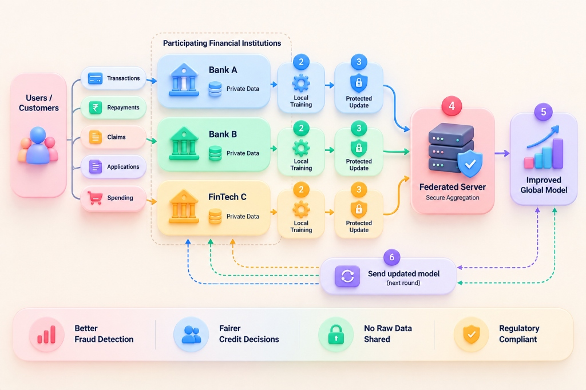

# FedGuard: Privacy-Preserving Financial Risk Control



## ⚠️ Problem We Are Solving
Financial institutions operate in silos due to strict data privacy regulations (like India's DPDP Act). Banks cannot share raw customer data with each other, leading to weak fraud detection models and poor credit decisions for thin-file customers. 

## 🔒 How We Are Solving the Problem
We implemented a **Federated Learning Network**. Instead of centralizing data, we decentralize the AI. Multiple financial institutions train a shared global model on their local, secure data. Only mathematically encrypted model updates are shared with the central server, ensuring zero raw data leakage.

## 📈 How It Helps
- **Better Fraud Detection:** A robust global model trained on diverse cross-institutional data.
- **Fairer Credit Decisions:** Improved credit scoring for users without compromising their private data.
- **Regulatory Compliant:** Completely adheres to DPDP/GDPR since no raw data ever leaves the bank.

## 🔄 The Flow in Short
1. **Local Training:** Each bank (Bank A, B, FinTech C) trains the model on its own private transaction data.
2. **Protected Update:** Banks send only the encrypted model weights (gradients) to the central server.
3. **Secure Aggregation:** The federated server combines all the protected updates to improve the Global Model.
4. **Send Updated Model:** The improved Global Model is distributed back to all participating institutions for the next round.

## 💻 Tech Stack
- **Federated Learning:** Flower (`flwr`)
- **Machine Learning:** PyTorch, Scikit-Learn
- **Privacy Engine:** Opacus (Differential Privacy)
- **Backend & Websockets:** FastAPI, Python, SQLite (Audit Logging)
- **Frontend UI:** Next.js 14, Tailwind CSS, Recharts, Framer Motion

## Quick Start (Development)

### 1. Server & Clients
```bash
# Setup Python Environment
python -m venv venv
source venv/bin/activate  # Windows: venv\Scripts\activate
pip install -r requirements.txt

# Start Central Server
cd backend && uvicorn main:app --reload

# Start Bank Clients (in separate terminals)
python clients/bank_a/client.py
python clients/bank_b/client.py
```

### 2. Frontend Dashboard
```bash
cd frontend
npm install
npm run dev
```
